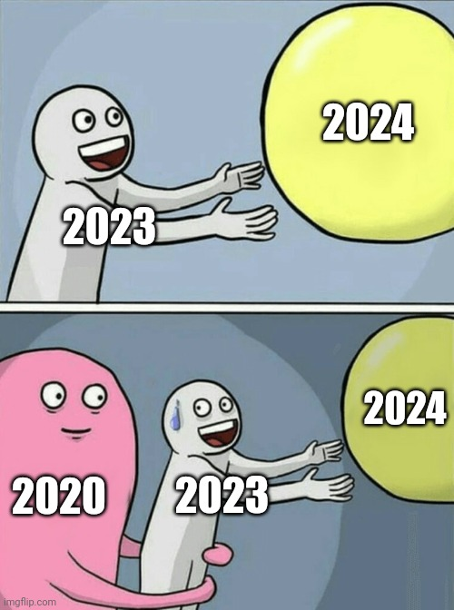

# 我的2023
 
2023對我來說就是不知不覺就結束了。本來還沈浸在剛上大學一定要在大學有一番作為到年底的時候突然發現已經快過完一半了，結果自己還是一事無成。或許維持常態才是所謂的“常態”，所以凡人如我還是把改變指望在平時每次小小的改變，透過這些改變造成“質的改變”。
<blockquote class="twitter-tweet">
3. 這個問題我只能說我覺得沒有做到。剛開始覺得離開園區以後生活少了那些限制會快樂很多，但是過了一段時間就開始覺得也不是那麼美好，甚至會強制自己少做那些事。而且我覺得自己沒有很好的融入這個社會，雖然沒有什麼特別不愉快的經驗(基本的察言觀色還是有的) 總之就是和我認知中的情況有落差
&mdash; \u8b19 (@cantpr09ram) <a href="https://twitter.com/cantpr09ram/status/1741473682281959857?ref_src=twsrc%5Etfw">December 31, 2023</a></blockquote> 
接著寫下去吧，不正常的人當久了當回正常人還是有難度的。以前他們都灌輸我們「你們出去會受到大家的愛戴」我不需要大家的愛戴但是我還是需要像個正常人吧？確實我可以感覺有些人待人處事需要再教育，但是我也認為我也有我的問題，在很多時候我就是個白痴但是我掩飾的很好，更慘的是我現在還是想不到解決的方案。

## 生活
應該說自己也不知道自己想要的是什麼吧。雖然我相信比起很多年紀相仿的人我想過的、我去了解過的一定比他們多。但可能因為同樣的原因我還是沒有辦法決定我現在要做什麼來幫助我未來可以得到我想要的，當然我還是可以先從當下想要的、通用的開始（主要就是搞點零用錢）  
🏃跑步：去年立下一個目標是多運動。但是也拖二月底才開始跑步，剛開始還想說要找個志同道合的人來一起跑，結果人家來一次就沒來過第二次了😭所以接下來都是一個人孤軍奮戰，後來才發現這樣的好處是可以靜下來，不管是聽podcast還是想事情，後來有了apple watch連通知都看不到。雖然在思考的事情可能對短時間來說是浪費時間，但是就像是前面說的一樣，透過每次的思考調整人生的方向、對事情的看法應該是件好事。最後公開我的跑步歌單（動態更新） 
<iframe style="border-radius:12px" src="https://open.spotify.com/embed/playlist/4IO6ahdF2KgrYYkRyOca9z?utm_source=generator" width="100%" height="352" frameBorder="0" allowfullscreen="" allow="autoplay; clipboard-write; encrypted-media; fullscreen; picture-in-picture" loading="lazy"></iframe>

💪健身：疫情解封以後我們社區的健身房也開放使用了，就抱持練個身體健康的態度每週固定去兩到三次。成果就是視覺上幾乎沒有改變，但是在跑步的時候可以感覺到以前會痠痛的地方現在會有這種感覺了。過程中也認識了一些住戶，這應算是意外的收穫  
👫人際關係：人際關係我還真的無解，有時候感覺自己就是熱臉貼人家冷屁股。現在私訊別人別人連看都沒看的話過幾天我就自己收回，以後也不會私訊他了，感覺很幼稚但是我覺得這是讓我覺得不尷尬的方法。還有一種狀況是你對人家客氣別人就對你很不客氣，不知道是對方沒禮貌還是我太敏感（我知道從前面的描述看我對人愛理不理同時也是個喜歡亂蹭的大混蛋🤡）
## 工作
今年工作大概賺了50000多，我知道這絕對不是一件值得拿出來說的事情，對我來說卻是有幾個意義 
💻：其中的30000多是我幫學校修改網站完成的，對我來說這證明我現階段寫程式的能力可以幫助我賺到錢，同時也檢視自己有哪些方面還需要加強。最爽的是我改一條指令就賺到一個禮拜工資了😎。最後這筆錢我拿去買了台Macbook了。更多的內容放在[這裡](https://cantpr09ram.github.io/something_about_part-time_job/ )  
👷：另外一個工作就是我去工地打工，從結果上看確實一個沒有任何經驗的人10天就賺了20000多，但是我想我可能不是很喜歡這個工作環境。感覺我跟他們對很多事情的看法相差太多了（我知道很像歧視但我認為是事實）當然錢夠多那又是另外一回事了  
最後補充我目前對我個人未來個人工作的想像：
1. 寫程式寫到寫不動（不管是因為AI還是什麼原因）➡️去修水電
2. 做一些軟硬體都要做的工作（個人認為在一段時間內甚至還會帶來機會 but who know）
3. 躺平（在人類被AI打到起不來已後我們也被只能這樣啦，或者是買相關的股票所謂“打不過就加入”）
## 學習
今年學習方面最大的不同之處大概是各式各樣的生成式AI帶來很多的改變。像是很多弱智的報告用它來完成就好了，一些問題問它也比上網查快很多，但是就跟有google很多人還是很無知一樣，工具不代表一切，不要不使用工具也不要被工具綁架。  
🎓學校：我之前發[<svg xmlns="http://www.w3.org/2000/svg" height="16" width="14" viewBox="0 0 448 512"><!--!Font Awesome Free 6.5.1 by @fontawesome - https://fontawesome.com License - https://fontawesome.com/license/free Copyright 2024 Fonticons, Inc.--><path fill="#74C0FC" d="M64 32C28.7 32 0 60.7 0 96V416c0 35.3 28.7 64 64 64H384c35.3 0 64-28.7 64-64V96c0-35.3-28.7-64-64-64H64zM351.3 199.3v0c0 86.7-66 186.6-186.6 186.6c-37.2 0-71.7-10.8-100.7-29.4c5.3 .6 10.4 .8 15.8 .8c30.7 0 58.9-10.4 81.4-28c-28.8-.6-53-19.5-61.3-45.5c10.1 1.5 19.2 1.5 29.6-1.2c-30-6.1-52.5-32.5-52.5-64.4v-.8c8.7 4.9 18.9 7.9 29.6 8.3c-9-6-16.4-14.1-21.5-23.6s-7.8-20.2-7.7-31c0-12.2 3.2-23.4 8.9-33.1c32.3 39.8 80.8 65.8 135.2 68.6c-9.3-44.5 24-80.6 64-80.6c18.9 0 35.9 7.9 47.9 20.7c14.8-2.8 29-8.3 41.6-15.8c-4.9 15.2-15.2 28-28.8 36.1c13.2-1.4 26-5.1 37.8-10.2c-8.9 13.1-20.1 24.7-32.9 34c.2 2.8 .2 5.7 .2 8.5z"/></svg>](https://x.com/cantpr09ram/status/1741471647134294409?s=20) 說我成績退步但是期末考結束成績出來甚至比上學期進步，但是就是沒有到我心目中的目標。我知道很多人比我聰明的同時也比我努力，但是我自己在努力的時候又會有一個想法「我再努力結果通常也是不會好到哪去」後來就只能用總有一天海水會退潮、人在做天在看這樣非常阿Q精神的方式來提醒自己堅持下去。總而言之演什麼像什麼，希望自己演的更好  
🧑‍💻程式：今年認識了很多新東西 [<svg xmlns="http://www.w3.org/2000/svg" height="20" width="17.5" viewBox="0 0 448 512"><path fill="#f75c08" d="M448 156.1c0-4.5-.1-9-.2-13.5a196.3 196.3 0 0 0 -2.6-29.4 99.6 99.6 0 0 0 -9.2-28A94.1 94.1 0 0 0 394.8 44a99.2 99.2 0 0 0 -28-9.2 195 195 0 0 0 -29.4-2.6c-4.5-.1-9-.2-13.5-.2H124.1c-4.5 0-9 .1-13.5 .2-2.5 .1-4.9 .2-7.4 .3a171.7 171.7 0 0 0 -22.1 2.3 103.1 103.1 0 0 0 -21.2 6.1q-3.5 1.5-6.8 3.1a94.7 94.7 0 0 0 -18.4 12.3c-1.9 1.6-3.7 3.3-5.4 5A93.9 93.9 0 0 0 12 85.2a99.5 99.5 0 0 0 -9.2 28 196.3 196.3 0 0 0 -2.5 29.4c-.1 4.5-.2 9-.2 13.5v199.8c0 4.5 .1 9 .2 13.5a196.1 196.1 0 0 0 2.6 29.4 99.3 99.3 0 0 0 9.2 28A94.3 94.3 0 0 0 53.2 468a99.5 99.5 0 0 0 28 9.2 195 195 0 0 0 29.4 2.6c4.5 .1 9 .2 13.5 .2H323.9c4.5 0 9-.1 13.5-.2a196.6 196.6 0 0 0 29.4-2.6 99.6 99.6 0 0 0 28-9.2A94.2 94.2 0 0 0 436 426.8a99.3 99.3 0 0 0 9.2-28 194.8 194.8 0 0 0 2.6-29.4c.1-4.5 .2-9 .2-13.5V172.1c0-5.4 0-10.7 0-16.1zm-69.9 241c-20-38.9-57.2-29.3-76.3-19.5-1.7 1-3.5 2-5.3 3l-.4 .3c-39.5 21-92.5 22.5-145.9-.4A234.6 234.6 0 0 1 45 290.1a230.6 230.6 0 0 0 39.2 23.4c56.4 26.4 113 24.5 153 0-57-43.9-104.6-101-141.1-147.2a197.1 197.1 0 0 1 -18.8-25.9c43.7 40 112.7 90.2 137.5 104.1-52.6-55.5-98.9-123.9-96.7-121.7 82.8 83.4 159.2 130.6 159.2 130.6 2.9 1.6 5 2.9 6.7 4a127.4 127.4 0 0 0 4.2-12.5c13.2-48.3-1.7-103.6-35.3-149.2C329.6 141.8 375 229.3 356.4 303.4c-.4 1.7-1 3.4-1.4 5.1 38.5 47.4 28 98.2 23.1 88.6z"/></svg> swiftUI](https://developer.apple.com/xcode/swiftui/)、[<svg xmlns="https://vuejs.org/" height="16" width="14" viewBox="0 0 448 512"><path fill="#63E6BE" d="M356.9 64.3H280l-56 88.6-48-88.6H0L224 448 448 64.3h-91.1zm-301.2 32h53.8L224 294.5 338.4 96.3h53.8L224 384.5 55.7 96.3z"/></svg> vue](https://vuejs.org/)、[<svg xmlns="http://www.w3.org/2000/svg" height="16" width="20" viewBox="0 0 640 512"><!--!Font Awesome Free 6.5.1 by @fontawesome - https://fontawesome.com License - https://fontawesome.com/license/free Copyright 2024 Fonticons, Inc.--><path fill="#74C0FC" d="M349.9 236.3h-66.1v-59.4h66.1v59.4zm0-204.3h-66.1v60.7h66.1V32zm78.2 144.8H362v59.4h66.1v-59.4zm-156.3-72.1h-66.1v60.1h66.1v-60.1zm78.1 0h-66.1v60.1h66.1v-60.1zm276.8 100c-14.4-9.7-47.6-13.2-73.1-8.4-3.3-24-16.7-44.9-41.1-63.7l-14-9.3-9.3 14c-18.4 27.8-23.4 73.6-3.7 103.8-8.7 4.7-25.8 11.1-48.4 10.7H2.4c-8.7 50.8 5.8 116.8 44 162.1 37.1 43.9 92.7 66.2 165.4 66.2 157.4 0 273.9-72.5 328.4-204.2 21.4 .4 67.6 .1 91.3-45.2 1.5-2.5 6.6-13.2 8.5-17.1l-13.3-8.9zm-511.1-27.9h-66v59.4h66.1v-59.4zm78.1 0h-66.1v59.4h66.1v-59.4zm78.1 0h-66.1v59.4h66.1v-59.4zm-78.1-72.1h-66.1v60.1h66.1v-60.1z"/></svg> docker](https://www.docker.com/)、[<svg xmlns="http://www.w3.org/2000/svg" height="20" width="22.5" viewBox="0 0 576 512"><path fill="#63E6BE" d="M420.6 301.9a24 24 0 1 1 24-24 24 24 0 0 1 -24 24m-265.1 0a24 24 0 1 1 24-24 24 24 0 0 1 -24 24m273.7-144.5 47.9-83a10 10 0 1 0 -17.3-10h0l-48.5 84.1a301.3 301.3 0 0 0 -246.6 0L116.2 64.5a10 10 0 1 0 -17.3 10h0l47.9 83C64.5 202.2 8.2 285.6 0 384H576c-8.2-98.5-64.5-181.8-146.9-226.6"/></svg> jetpack compose](https://developer.android.com/jetpack/compose?hl=en)...但是都是摸一下。有的是興趣使然，有的是用來解決當下一個特定的問題，用一種try error 的方式來學。當然這些東西應該還是有一些基本的東西需要知道。興趣使然的東西應該要嘗試用看看。  
🇫🇷語言：10月開始用duolingo學法文，算是興趣使然吧，希望可以堅持到把這個課程上完（我估計大概要2年多）。但是我相信是不同的體驗。  
📖閱讀：2023看了12本書（這個我有空再來更新

1. 參加馬拉松: 都密集訓練一年多了，應該要參加一些比賽來驗收一下成果。一方面增加成就感，一方面練習適應不同的情況
2. 找個軟體公司實習: 軟體工程不只是寫程式這樣而已，還是希望可以學習像是如何團隊合作、CI/CD、甚至是基本的 git worfflow 
3. 嘗試多認識各式各樣人：這我一時也想不到如何實踐，但是這應該是我非常需要的